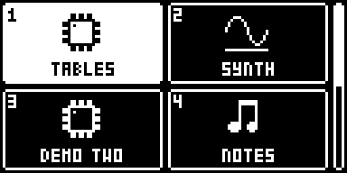
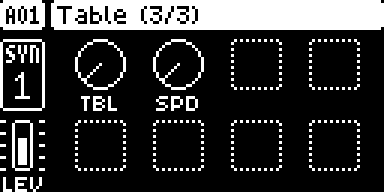

# core for the Digitone mk1

The boot copier and the hook bus for the Digitone mk1 and Digitone Keys,
OS 1.43 and 1.44. It is [../core/core.s](../core/core.s), with
[settings.s](../core/settings.s) and [render.s](../core/render.s), built with the
Digitone's addresses and sites (`mod.json`: 1.43's, and 1.44's under
`ports`). Every set of linkable (format 2) mods for
the Digitone needs it. On its own it changes nothing the unit does.

- **At boot** (the OS entry's call at 0x40000538, as on the Digitakt),
  `boot` copies the RAM image the linker built to 0x47BE0000, zeroes
  `.bss`, starts the DTIM0 counter if nothing has, and goes on to the call
  it replaced.
- **The events** are the Digitakt mk1's (docs/ADAPTING.md, "The hook
  bus"), from the Digitone's sites: 0x4001900c (tick), 0x40019072 (draw),
  0x40019d9c (key), 0x40019de4 (encoder), 0x40072a34 (SETTINGS),
  0x4009d108 and 0x4009e51c (the render's entry and exit). In 1.44 the
  last three are 0x40072a54, 0x4009d128 and 0x4009e53c; the rest are where
  they were.
- **From 2.1, `ev_voice_on`** ([voice.s](voice.s)), which the Digitakt's
  core does not have: at 0x4009e928 (0x4009e948 in 1.44), where the
  render's note-on loop stores a voice's pitch word (the note << 16, at
  `0x41391f80` + 4 x voice; `0x41392f80` in 1.44), it
  makes that store itself and calls `f(voice, track, event)`. A handler
  may change the pitch word: the render reads it every block, so a change
  is heard within about three blocks. The voice's sound and the step's
  locks are loaded after this point; read the voice's parameters from
  `ev_render_out`.
- **From 2.1, parameter slots** ([params.s](params.s)): ids 182-184 for
  mods' own parameters, handled by the stock UI as its own (knob, pop-up,
  value, p-locks). At boot `core_dn_boot` moves the two small tables after
  the stock parameter records to `core_ptab_save` and installs the records
  contributed to `core_params` in their place; the firmware's 58 id
  bounds are raised by three, and the UI record lookups build each slot's
  record from the stock one it borrows (docs/ADAPTING.md, "Parameter
  slots").
- **From 2.1, mod pages** ([pages.s](pages.s)): pages 27-30 for mods,
  each put after a stock page in its key's list (AMP's third page, say)
  and shown, turned and p-locked by the stock UI. The page record lookup
  serves them, the views' builder puts them in their key's list, and
  `core_page_open` opens one from a key handler, `core_page_shown` says
  whether it is on screen (docs/ADAPTING.md, "Mod pages").
- **From 2.1, project data** ([projdata.s](projdata.s)): mods' blocks
  saved and loaded with the project, in the 480 bytes of its storage
  header the OS leaves alone. The serializer's entry puts them there for
  every save; the loads and the new project's builder take them out, or
  tell the mod there are none (docs/ADAPTING.md, "Project data").
- **From 2.2, the Mod Menu** ([menu.s](menu.s)): hold a track key on its
  own and core opens a menu of what mods contributed to `core_menu` (a name
  and an `open` function each), unless a handler of `ev_hold` takes the
  hold first. The four UI sites go to `core_dn_tick`, `core_dn_draw`,
  `core_dn_key` and `core_dn_enc`, which see to the menu and go on to
  core.s's (docs/ADAPTING.md, "The Mod Menu").
- **From 2.3, the menu is a grid of icons:** tiles two across and two down,
  each an entry's 16 x 16 icon over its label, with a scroll bar; the
  arrows move by tile and row. A descriptor may add the tag `0x49434F4E`
  ("ICON") and an icon after its `open`; one without (2.2's) gets a chip.
  Below, from digikit's emulator, with digitables 1.3 and a test mod's
  seven entries linked: holding T1 opens the first page, with TABLES
  selected; RIGHT and then DOWN three times reach the last row, and the bar
  on the right has moved down with it; YES on TABLES opens digitables' page.

  
  
  
- **From 3.0, firmware locations as exports** ([fw.s](fw.s)): the data and
  routines Digitone mods use, as symbols. They cover the voices' pitch words,
  parameters and lengths, the timeline, the LFOs, the note queue, the kit,
  the slot ids, and drawing. 1.43's values are in mod.json and 1.44's in its
  port. A mod that names them instead of addresses builds for both OS
  versions unchanged (`elekloader/sdk/include/digitone-mk1/core3.h`;
  docs/ADAPTING.md, "Firmware locations (core-dn1 3.0)"). Nothing else
  changes: 3.0 is 2.3's code, sites and tables.
- **From 3.1, what machines need** (docs/ADAPTING.md, "Machines and stock
  parameters"):
  - `ev_render_voices` ([voices.s](voices.s)): each block, the DSP's eight
    voices (32 samples each, `fw_voices`) after they reach SRAM and before
    the render's multimode filter, at 0x4009e078 (0x4009e098 in 1.44). A
    handler may write a voice's block: that is the voice's sound through
    its filter, the mixer and the effects. The machines mod
    ([../machines-dn1](../machines-dn1)) plays its machines there.
  - `core_param_override` ([params.s](params.s)): a mod answers for a stock
    parameter while it wants to: its UI record (value text, knob graphic,
    how a turn moves it) and its label. Core consults the table in its UI
    record lookups, and replaces the routine that makes a knob's label
    (0x400207b8, the same in 1.44). `core_param_ui_make` builds a UI
    record from a stock parameter's turn and another one's graphic.
  - `core_sound_set(track, slot, value)`: a sound slot changed as a stock
    edit changes it, the kit and then the track's voices. A voice keeps the
    sound it loaded last and loads it again only for another sound, so a
    write to the kit alone is not heard on a track's voices until a stock
    edit reloads them.
  - `core_menu_open(list, sel, pick)` ([menu.s](menu.s)): an entry's open()
    shows a list of its own in the Mod Menu's grid, a submenu.
  - Six more firmware locations: `fw_voices`, `fw_voice_track`,
    `fw_gate_on`, `fw_active_track`, `fw_params` and `fw_uirecs`.

  3.1 keeps everything 2.3 and 3.0 have: their sites, tables, code paths
  and exports, so every 2.x and 3.0 mod links with it (`tests/test_sdk.py`
  checks it against the released 2.3). It adds two sites and two tables.
- **From 3.2, exclusive audio** ([audio.s](audio.s); docs/ADAPTING.md,
  "Exclusive audio"): a mod may take the whole output while it wants to.
  Each block core takes the first record in the table `core_audio` whose
  `on` is set. While there is one, the render's master stage (the inputs'
  mix, chorus, delay, reverb and drive, called at 0x4009e146) does not run,
  and the owner's `render(out, in)` gets the input and writes the output.
  With `CORE_AUDIO_MUTE_VOICES` the voices' filter loop (0x4009e07e) is
  skipped too, so the synths are silent. Also `fw_tempo`,
  the tempo x 120, and the stock pages' fonts, `fw_font_label` and
  `fw_font_title`, for a mod that draws a page of its own in their style. The profile's `bulk` area (0x44000000-0x47BE0000) holds
  such mods' large buffers, as regions they claim.
  [examples/dn-thru](../../examples/dn-thru) is the smallest such mod.
- **From 3.2, `ev_midi_cc`** ([midi.s](midi.s)): each MIDI CC the unit
  receives on a track's channel (1-9 by default) or the auto channel, as
  `f(track, cc, value, flags)`, before the stock applies it; a handler
  that returns nonzero takes it. The site is the CC router's track check
  at 0x400ed96e (0x400edbe2 in 1.44), 32 bytes past the router's entry,
  which Tone+FX patches: the two link together, and a CC Tone+FX lets
  through comes to core next.
- **From 3.3, insert audio** ([audio.s](audio.s); docs/ADAPTING.md,
  "Insert audio"): an owner with `CORE_AUDIO_INSERT` in its flags gets
  what the master stage made instead of the input: the stage runs as
  stock, and its output goes through the owner's `render` on its way to
  the codec and USB's main pair. An effect on everything the Digitone
  plays, which may stay on under the Digitone's own pages. No new site:
  3.3 is 3.2 with that flag. [examples/dn-tremolo](../../examples/dn-tremolo)
  is the smallest such mod.
- **OS 1.44:** every site has its port (`ports` in mod.json): the same
  code, moved, and RAM 0x1000 further on.

Build it with the SDK (it needs m68k binutils):

```bash
python -m elekloader.sdk.build mods/core-dn1 --stock Digitone_and_Digitone_Keys_OS1.43.syx   # out/core-3.3.elemod
python -m elekloader.sdk.build mods/core-dn1 --stock Digitone_and_Digitone_Keys_OS1.44.syx   # out/core-3.3-os1.44.elemod
python -m elekloader.lint mods/core-dn1/out/core-3.3-os1.44.elemod --stock Digitone_and_Digitone_Keys_OS1.44.syx
```

A release names them `core-dn1-3.3.elemod` and `core-dn1-3.3-os1.44.elemod`.
3.3 is not released yet;
3.2's are on the [core-dn1-v3.2](https://github.com/irpina/elekloader/releases/tag/core-dn1-v3.2) pre-release
(3.0 and 3.1 were not released), and
2.3's on the [core-dn1-v2.3](https://github.com/irpina/elekloader/releases/tag/core-dn1-v2.3) pre-release.

Checked by cold-booting it in digikit's emulator against stock (docs/DEVICES.md):
- every stage passes, and every screen is identical;
- the audio is identical up to PLAY, then the same sound slightly shifted in
  time, as stock's own is when PLAY lands 0.3 ms later.

The 1.44 port is checked the same way, against stock 1.44 (from 2.3):
every stage passes, and every screen is identical. It is the same code with
1.44's addresses. Its eight sites hold the same stock bytes as 1.43's, and
each routine it calls was found again by its own code, with the addresses
in it masked, and checked against the code that calls it. It lints and
links, and a build with it verifies, depacking in place.

3.1 was checked the same way on 1.43 and 1.44: every stage passes and every
screen is identical. With the machines mod, SINE and digitables 1.4, on both
versions, SINE plays at the note through the filter and the AMP envelope
while the other tracks stay FM ([../machines-dn1](../machines-dn1)). Its two
new sites are the same code in 1.44 (the voices' site calls the routine
it calls at its new address), and the setter's last step, `SOUND_LIVE`, was
found again by its own code.

3.2 was checked the same way on 1.43 and 1.44: every stage passes, every
screen is identical, and the audio is identical up to PLAY. With THRU
([../../examples/dn-thru](../../examples/dn-thru)) open while the factory
pattern plays, the inputs reach the output at their own level and the FM
does not; after NO the FM is back. Its two new sites are the same code
in 1.44, 0x20 bytes later, as are the routines they call.

`ev_midi_cc` was checked with CCs sent into the emulator's MIDI input on
1.43 and 1.44, with a mod's handler that takes the CCs it maps: a CC it
takes stops at core's site, and one it lets go, or any CC while it has
nothing to take, goes on into the stock router. With the default
channels, channels 1-9 came as tracks 0-8 (all nine on 1.43, 1 and 4 on
1.44), the auto channel as the active track with `CORE_MIDI_CC_AUTO`,
and channel 12, which no track uses, never reached the site. The site's
six bytes and the router's exit are the same code in 1.44, 0x274 bytes
later. Core 3.2 links beside Tone+FX 3.0a, which patches the router's
entry.

3.3 was checked the same way on 1.43 and 1.44: every stage passes, every
screen is identical, and the audio is identical up to PLAY. With TREMOLO
([../../examples/dn-tremolo](../../examples/dn-tremolo)) on while the factory
pattern plays, the pattern comes out with a 4 Hz wobble (its level's 4 Hz
part 0.26 of its mean, against 0.008 stock), and picking TREMOLO again gives
the stock sound back; on the cycle clock, the stock master stage takes
53,240 cycles of a block, core's conversion in and out 602 and TREMOLO
926.
`tests/test_sdk.py` checks that it keeps all of the released 3.2: the
same sites, tables, contributions and exports, with only audio.s's code
changed.
